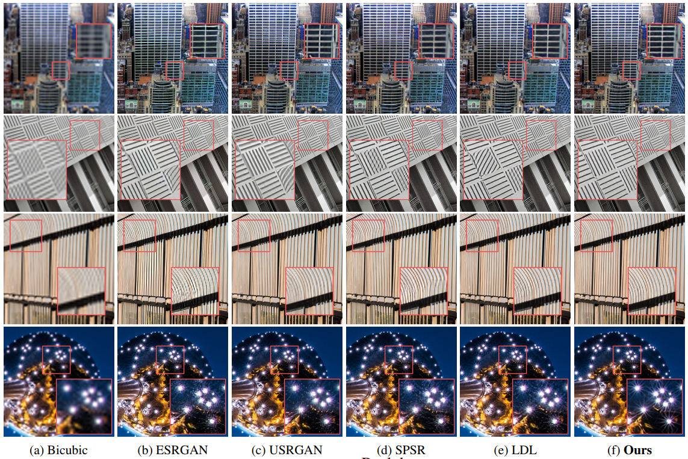
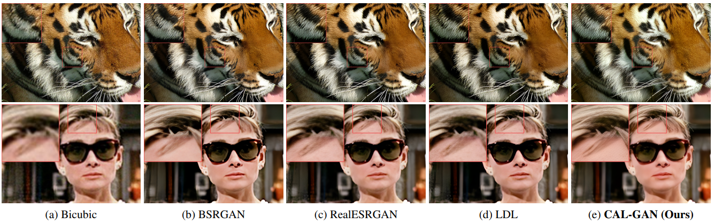
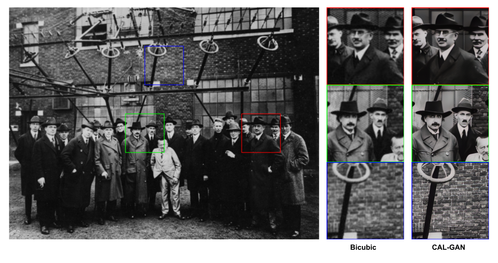

# CAL_GAN
This repository is an official implementation of the paper "Content-Aware Local GAN for Photo-Realistic Super-Resolution (ICCV 2023)".

Please refer to the paper for details:
https://openaccess.thecvf.com/content/ICCV2023/papers/Park_Content-Aware_Local_GAN_for_Photo-Realistic_Super-Resolution_ICCV_2023_paper.pdf

### Abstract
Recently, GAN has successfully contributed to making single-image super-resolution (SISR) methods produce more realistic images.
However, natural images have complex distribution in the real world, and a single classifier in the discriminator may not have enough capacity to classify real and fake samples, making the preceding SR network generate unpleasing noise and artifacts.
To solve the problem, we propose a novel content-aware local GAN framework, CAL-GAN, which processes a large and complicated distribution of real-world images by
dividing them into smaller subsets based on similar contents.
Our mixture of classifiers (MoC) design allocates different super-resolved patches to corresponding expert classifiers.
Additionally, we introduce novel routing and orthogonality loss terms so that different classifiers can handle various contents and learn separable features.
By feeding similar distributions into the corresponding specialized classifiers, CAL-GAN enhances the representation power of existing super-resolution models, achieving state-of-the-art perceptual performance on standard benchmarks and real-world images without modifying the generator-side architecture.




#### Getting started

- Clone this repo.
```bash
git clone https://github.com/jkpark0825/CAL_GAN
cd CAL_GAN
```

- Install dependencies. (Python 3 + NVIDIA GPU + CUDA. Recommend to use Anaconda)
```bash
pip install -r requirements.txt
```

- Prepare the training and testing dataset.
- Prepare the pre-trained models (PSNR oritented models) from https://github.com/xinntao/ESRGAN.

#### Training
If you prefer not to train the model, you can simply obtain the pretrained model by downloading it from this link:

Synthetic: https://drive.google.com/file/d/1qWGpKE0sUKnB1Rd5_1KOdCvi5xRNUgQ9/view?usp=sharing.

Real-world: https://drive.google.com/file/d/19x8UZ1j8yLtK7SGExeycd0pyoxuQ3F-_/view?usp=sharing

Adapt yml file:  ```options/trainCAL_GAN/*.yml``` 

- Single GPU:
```bash
PYTHONPATH="./:${PYTHONPATH}" CUDA_VISIBLE_DEVICES=0 python basicsr/train.py -opt options/train/CAL_GAN/*.yml --auto_resume
```

- Distributed Training:
```bash
PYTHONPATH="./:${PYTHONPATH}" CUDA_VISIBLE_DEVICES=0,1,2,3 python -m torch.distributed.launch --nproc_per_node=4 --master_port=5678 basicsr/train.py -opt options/train/CAL_GAN/*.yml --launcher pytorch --auto_resume
```

Training files  will be saved in the directory ```./experiments/{name}```

#### Testing

Adapt the yml file ```options/test/CAL_GAN/*.yml``` 

- Save visual results for real-world image super-resolution:
```bash
PYTHONPATH="./:${PYTHONPATH}" CUDA_VISIBLE_DEVICES=0 python basicsr/test.py -opt options/test/CAL_GAN/*.yml
```

Evaluating files (logs and visualizations) will be saved in the directory ```./results/{name}```


### Acknowledgement
This code is based on 
[BasicSR](https://github.com/xinntao/BasicSR) project.
